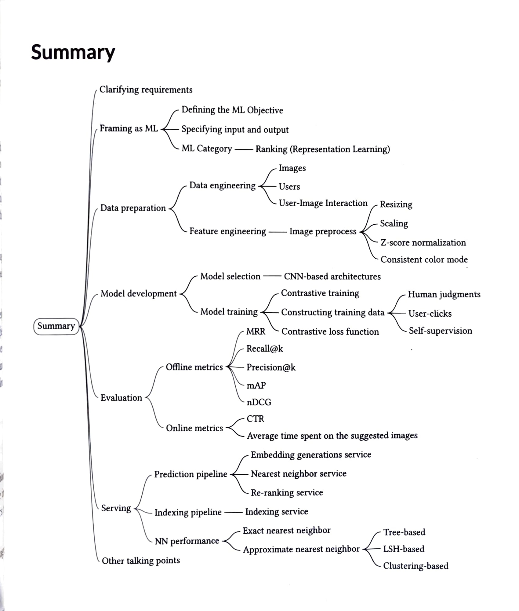

# visual-search-system

## Image Operations
* **Resizing:** 
* ***Scaling:**
* **Z-score normalization:**
* **Consistent color mode:**

## Models Selection
* ### CNN-based architectures
  * **ResNet**
* ### Transformer-based architectures (trending)
  * **VIT**

## Machine learning flowchart for choosing project components.

